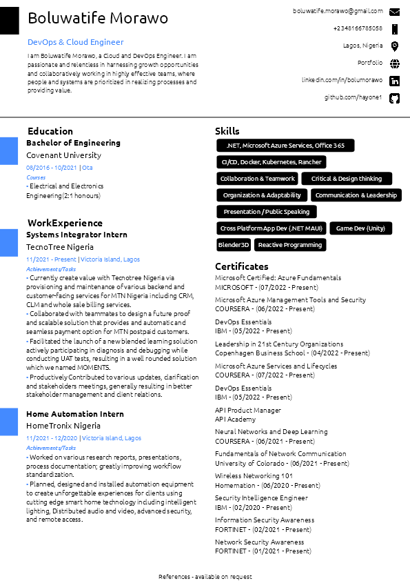
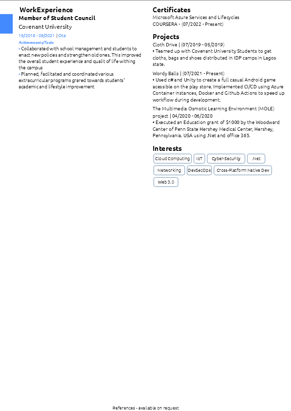

# QuestPDF RESUME DEMO

A Showcase of [QuestPdf](https://www.questpdf.com/introduction) features using features such as Row, Column, Decoration, Paging, Images, Tables, Textstyles etc...

## Data Structure
Data is separated into [header](https://github.com/hayone1/ResumePDF/tree/master/Data/HeaderLeft), [content](https://github.com/hayone1/ResumePDF/tree/master/Data/ContentLeft) and [footer](https://github.com/hayone1/ResumePDF/tree/master/Data/Footer) and placed inside [Data](https://github.com/hayone1/ResumePDF/tree/master/Data) folder.

- Header (HeaderLeft & HeaderRight) folder will use only the first (alphabetical) json in their folder. Preferably only use the `BasicBullet` and `ContactModel` Json Format in the Header Folders.

- Content (ContentRight & ConteentLeft) folder will read all valid Jsons from their folders and display it in the content section. The order in which the Json data appears is based on the alphabetical order of the folder Names.
- > Valid Jsons are in the Templates Folder

- Footer will only display Json that matches the `Footer` Json format.